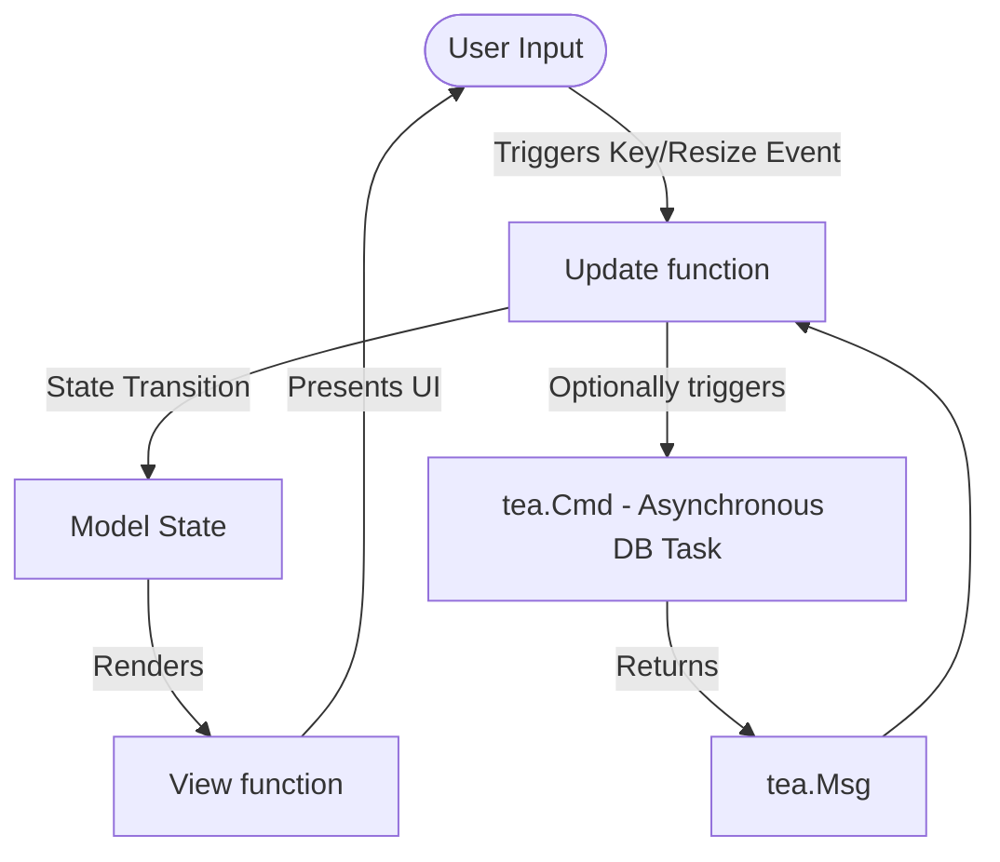

# dbbee Architecture 🐝🏛️

This document describes the design, code organization, and structural patterns used in `dbbee`.

---

## 📂 Project Directory Structure

```text
dbbee/
├── cmd/
│   └── dbbee/              # Main application entry point (main.go)
├── internal/
│   ├── db/                 # Database schema retrieval and client operations
│   ├── export/             # CSV, JSON, Markdown formatting utilities
│   └── tui/                # TUI root orchestrator (Model, Update, View)
│       ├── components/     # Decoupled panels: Sidebar, Grid, Editor
│       └── styles/         # Lip Gloss theme tokens and UI styles
├── go.mod                  # Module manifest
└── README.md               # Quickstart and documentation
```

---

## 🎨 TUI Elm Architecture (Model-View-Update)

`dbbee` is built entirely on Bubble Tea, which uses the Elm architecture:



### 1. The Model
The main [Model](file:///C:/Koding/TUIsqlite/internal/tui/model.go#L19) maintains application-wide states:
- `DB`: References the SQLite client.
- `ActiveTab`: Tracks whether Sidebar, Grid, or Editor has active keyboard focus.
- `Sidebar`, `Grid`, `Editor`: Instances of sub-component models.
- `Loading`: Displays the loading spinner while DB commands execute.

### 2. The Update Loop
Events flow through [Update](file:///C:/Koding/TUIsqlite/internal/tui/update.go#L10).
- Key events switch focus (`tab`/`shift+tab`) or trigger specific sub-component handlers.
- When an operation is asynchronous (e.g. executing queries or schema parsing), the update loop returns a `tea.Cmd`. Once completed, this command returns messages like `LoadTableDataMsg` or `RunQueryResultMsg` back to `Update` to refresh the TUI safely.

### 3. The View
[View](file:///C:/Koding/TUIsqlite/internal/tui/view.go#L10) calculates the layout dynamically using Lip Gloss borders, padding, and layout join functions.

---

## 🗄️ Database Integration

- **CGO-Free Engine**: We use `modernc.org/sqlite` as the driver. It translates C code into Go bytecode, providing full SQL compatibility without needing GCC toolchains.
- **Operations Client**: Implemented in `internal/db/`:
  - `client.go`: Connection lifecycle, read-only fallbacks, and header validation.
  - `schema.go`: Table lists, schema info parser, custom query executors, cell updates, row insertion, and row deletion.


